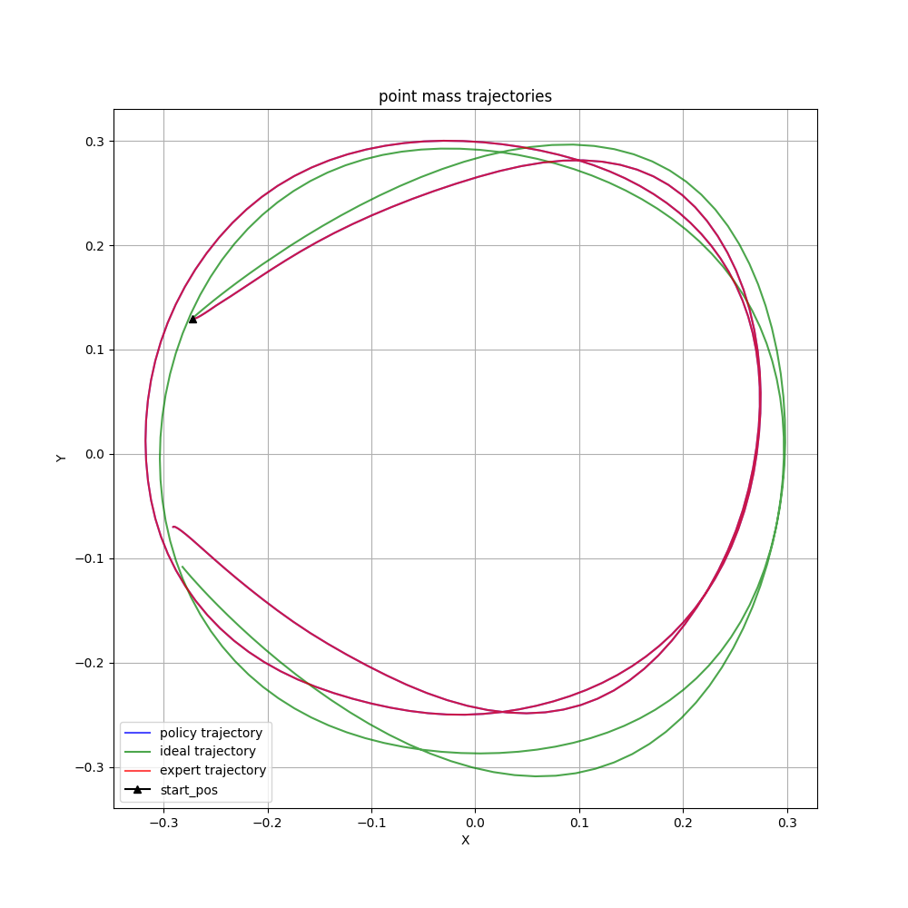
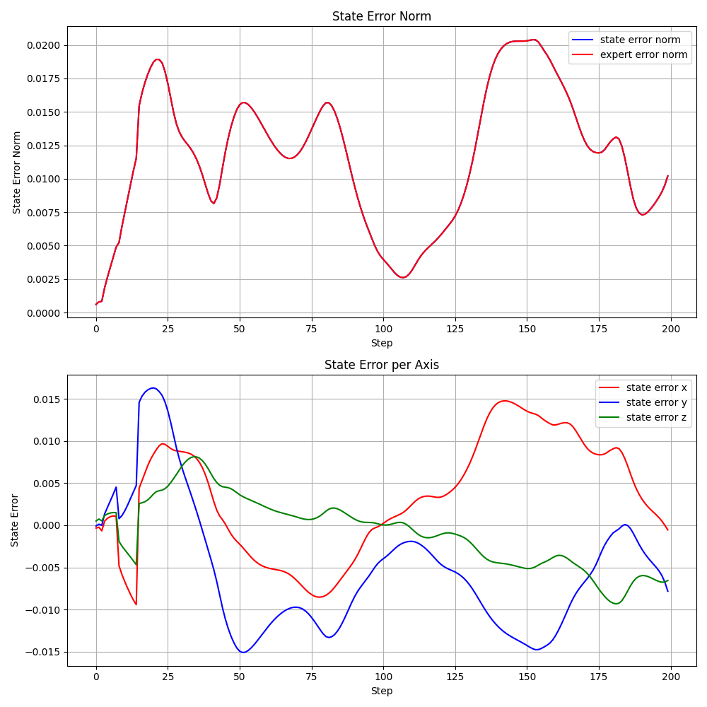

## research
[IL research](https://docs.google.com/document/d/1qL__5ltoS9RlNtAtyIXOkichVQ9TchGlXO6cpNntQVI/edit?usp=sharing)
## notes
date: 30-12-24
weeks left: 21

- progress:
	- understamding dagger implementations (code)
- next steps:
- questions:	
- discussion:
  - on or off policy
    - thrifty uses ensemble of n (num_nets) MLP Actors and 2 (optional) Q Functions
    - dagger: 1 MLP
    - lazyDagger: 1 MLP
    - hg-dagger: ensemble
    - EnsembleDagger: ensemble
  - MLP Hyperparameter
    - layers
    - sizes
    - batch size
    - gradient steps

## old notes
date: 23-12-24
weeks left: 22

- progress:
	- train dagger on multiple trajectories and validate on new one
    - noise in training data
    - sweeps for dagger in wand
- next steps:
    - change thrifty algo to il library style
    - enable hyperparameter sweeps  for thrifty
- questions:	
  - for some trajectories where the z values do not change, the policy cant hold in place is off (see plots below)

### validation trajectorie performance

| Algorithm | Mean State Error | Std State Error | Mean Velocity Error | Std Velocity Error | Online Burden |
|-----------|-----------------:|----------------:|---------------------:|-------------------:|--------------:|
| DAgger    |        0.0446   |       0.0219  |             0.30400  |           0.1654  |            -- |
### plots
policy and expert is same because the expert does not exist

### z-axis problem

date: 16-12-24
weeks left: 23

- progress:
	- fixed inital target state (step function was correct)
    - get trajectory from splines 
    - 3d trajectory (spring)
    - changed observation (pos error, vel error, acc_des)
    - metrics
- next steps:
    - change dagger class
    - same iters for algos
    - enable hyperparameter sweeps
- questions:	
  - 
### Algorithm metrics

| Algorithm | Mean State Error | Std State Error | Mean Velocity Error | Std Velocity Error | Online Burden |
|-----------|-----------------:|----------------:|---------------------:|-------------------:|--------------:|
| DAgger    |        0.05183   |        0.00848  |             0.30400  |           0.12037  |          4200 |
| Thrifty   |          0.09467 |        0.03861  |             0.54615  |           0.19676  |          1095 |
### dagger performance

### thrifty-dagger performance

### dagger with fixed target state

date: 09-12-24

- progress:
	- implemented [thrifty dagger](https://arxiv.org/abs/2109.08273)
- next steps:
    - implement diff dagger
- questions:	
  - thrifty dagger 

### dagger performance

### thrifty-dagger performance

date: 02-12-24

- progress:
	- (circle) trajectory tracking for pd controller
	- db_cbs as expert policy
- next steps:
    - fix ending for db_cbs as expert policy
	- multiple robots at once
- questions:
	- how to handle new state for expert policy
	    (right now i use the closest state (euclidian) but
	    that doesnt work when it overshoots)

date: 25-11-24

- progress:
	- pid controller works properly
	- dagger trains on multiple envs with different target states
- next steps:
    - evaluate model with new problem environment
    - improve reward and cost function?
- questions:
	- is adding target state as the observation for training correct?
	    -- in papers local observation was used for training
    - should i work on reward and cost function?