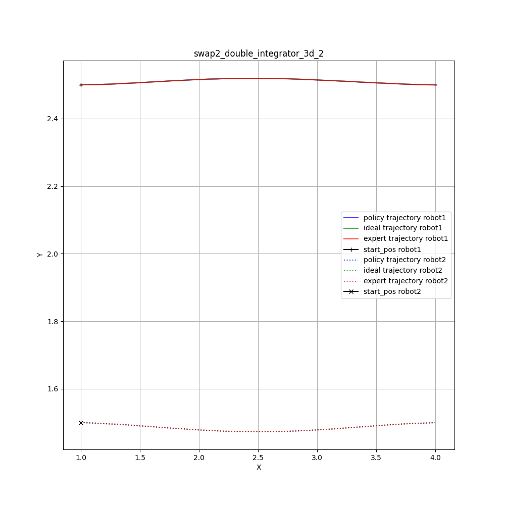
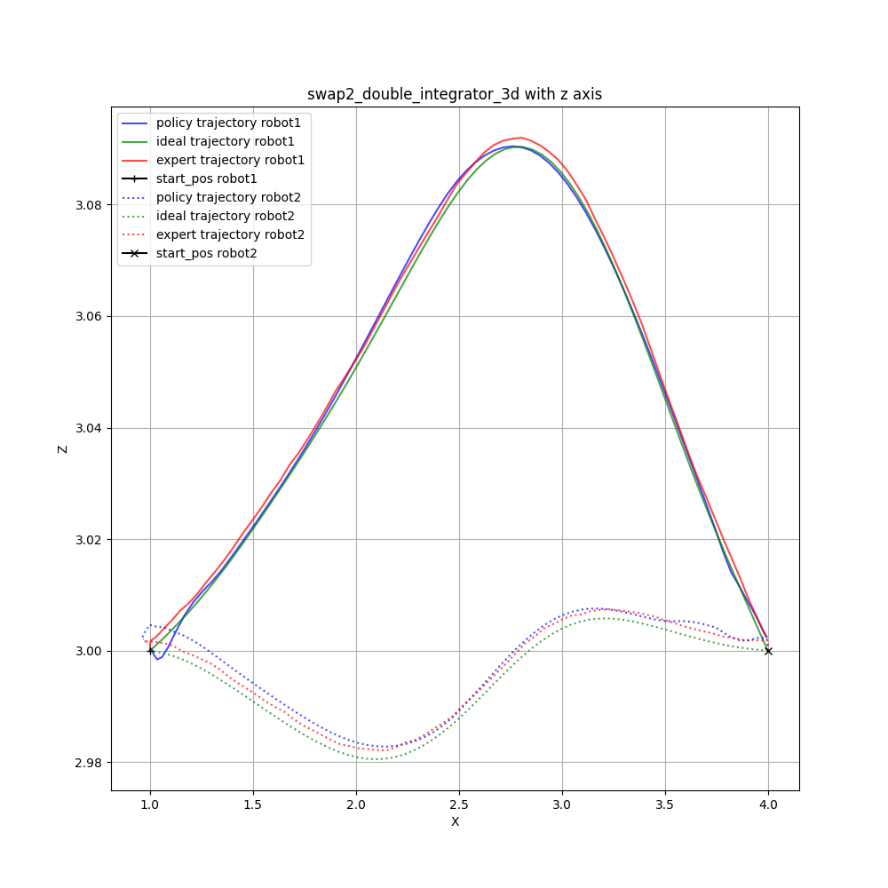
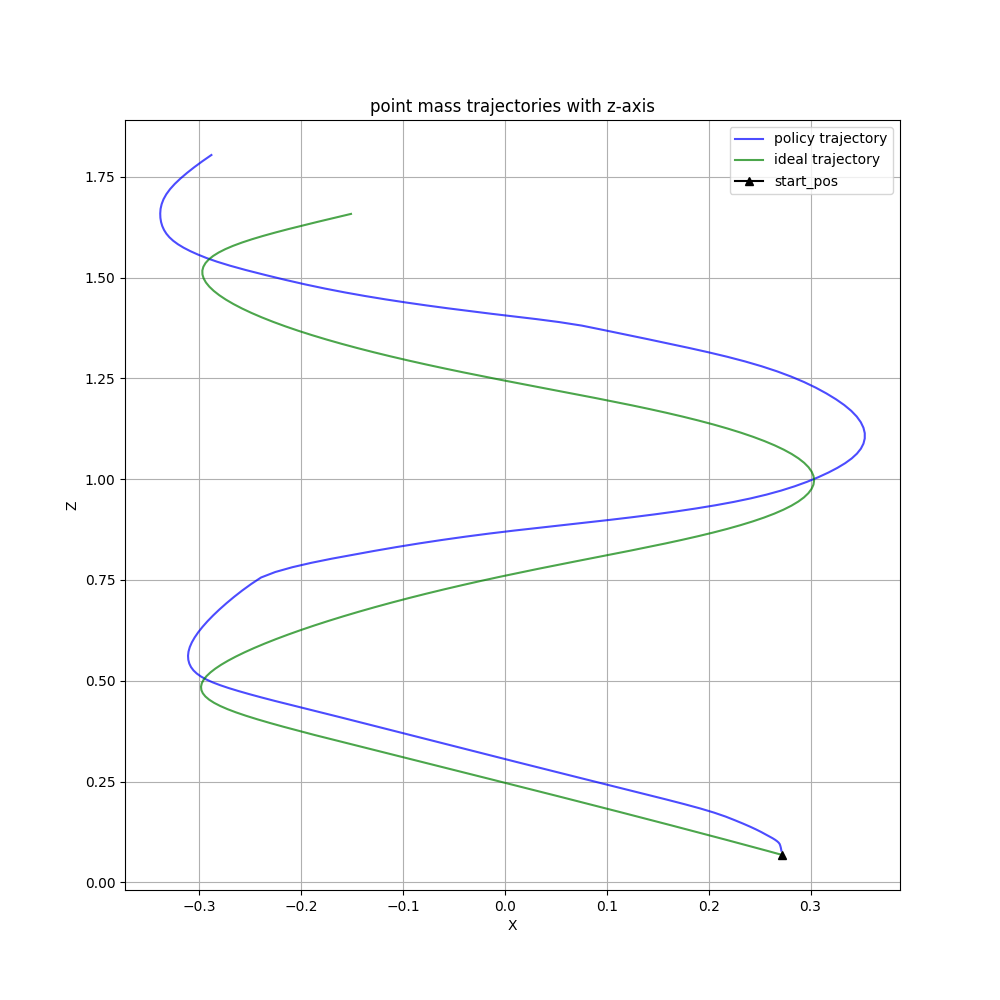

## research
[IL research](https://docs.google.com/document/d/1qL__5ltoS9RlNtAtyIXOkichVQ9TchGlXO6cpNntQVI/edit?usp=sharing)

## notes
date: 14-04-25
weeks left: 8
- progress:
  - sweeps for decentralized and centralized dagger
    - decentralized works really well for first test case and not at all for the other
- next steps:
  - get workstationa access 
  - thrify sweeps
## old notes
date: 24-03-25
weeks left: 10
- progress:
  - trainign data generation
  - 2 robot training for decentralized and centralized
- next steps:
  - finalize ensemble 
  - thrify training
- discusion:
  - observation space for the decentralized case
  - which states for training

date: 17-03-25
weeks left: 11
- progress:
  - expert controller with dynobench step function
  - training and validation scripts
- next steps:
  - implement ensemble policy
  - train decentralized policy
- questions:
  - how much should i focus on different policies? 
    - dagger: uses 1 ActorCritic MLP
    - thrifty: ensemble of Actor MLP and 2 MLPQFunction for threshold predictions
    - try different policies?
- discusion:
  - what should be feasability constraints for the trajectories?
    - robots to close to each other?
    - robot rotations
date: 03-03-25
weeks left: 12
- progress:
  - trying to get the simulation working with feedforward control
date: 24-02-25
weeks left: 13
- progress:
  - observation data from mujoco
- questions:
  - rotation/frames 
- next steps:
  - extract correct observation data
  - implement coltrans controller
  - create more trajectories
  - training setup
date: 17-02-25
weeks left: 14
- progress:
  - create payload system mujoco with explicit start pos
  - part integration into dagger with feedforward controller
- questions:
  - train on state or ref state
  - whats accelerations and mu_planned in coltrans solution file
- next steps:
  - extract correct observation data
  - implement coltrans controller
  - create more trajectories
  - training setup

date: 03-02-25
weeks left: 16
- progress:
  - cable dynamics implemented
  - training setup for different variable number of robots, variable observation and action space, different trajectories,
- questions:
  - observation of quadrotor 
    - pos(x,y,z) + rot(qx, qy, qz, qw) or pos error
    - vel(vx, vy, vz) or vel error
    - relative payload pos (px, py, pz)
    - relative pos of other robots n*(xi,yi,zi)
- next steps:
  - record demonstrations for presentation
  - validate model
  - implement full dynamcics of payload system

## dagger

| Trajectory | Mean State Error | Std State Error | Mean Velocity Error | Std Velocity Error |
|------------|-----------------:|----------------:|--------------------:|-------------------:|
| training 1 |           0.0708 |          0.0181 |              5.1828 |           1.4763  |
| training 2 |           0.0879 |          0.0284 |              5.3384 |           1.5023  |
| validation |           0.0829 |          0.0213 |              5.5264 |           1.5318 |

### training trajectory 1

### training trajectory 2

### validation trajectory

## thrifty

| Trajectory | Mean State Error | Std State Error | Mean Velocity Error | Std Velocity Error |
|------------|-----------------:|----------------:|--------------------:|-------------------:|
| training 1 |          0.3493|          0.1492 |              5.4138 |           1.8014 |
| training 2 |           0.3012 |          0.1021 |              5.4679 |           1.9933  |
| validation |           0.6516 |          0.3807 |              5.1849 |           1.4636 |

### training trajectory 1

### training trajectory 2

### validation trajectory

date: 27-01-25
weeks left: 17
- progress:
  - decentralized learning for 3d double integrator 
  - implemented cable dynamic (run mujoco_test/test/test_cable.py)
    - connecting cable and quadrotor dynamics does not work, as the simulation gets infeasible acc just by putting both 
        models in the same simulation (also when they are not connected)
- next steps:
  - fixing the model
## dagger plots

## old notes
date: 13-01-25
weeks left: 19

- progress:
  - dynamics implementation for 2 quadrotor with payload 
    - based on viktors implementation
    - the cables are off, i need to figure out how to implement them
    - run mujoco_test/test/2quad_1payload.py to test
  - in the process of implementing learning for each drone individually
    - needs more time
    - my idea is to take the observation from the env (which has the obs of all drones), split the obs-act pair for each robot and then process for each robot and then combine the next action (expert or policy) step through the env 
- next steps:
  - implementations for 
- questions:
  - is the approach for decentralized control learning flawed?
  - when I take the positional error as an observation for a robot, shouldnt I also take the distance to the other robots as obs and not the position of the other robots
    - or doesnt it matter with the observation space i have when using the planner as an expert?

date: 05-01-25
weeks left: 20

- progress:
	- thrifty implemented in same style as dagger (needs ensemble policy for full feature)
    - fixed expert-ideal trajectory offset by increased gains k_p
    - implemented 2 robot case (double integrator) from db-cbs output yaml
      - observation space (model input) is n_robot * (pos_err, vel_err, acc_des, other robots positions)
- next steps:
  - quadrotor payload dynamics
  - payload system dbcbs
- questions:
  - in the multirobot case if the trajectories are of different length is it okay to fill the shorter trajectory with 0 actions (stay in place) at the end

| Algorithm | Mean State Error | Std State Error | Mean Velocity Error | Std Velocity Error |
|-----------|-----------------:|----------------:|---------------------:|-------------------:|
| DAgger    |        0.0765   |       0.0207  |             5.1905 |           1.5435  |
| Thrifty   |         0.1275 |        0.0554  |             4.9603  |           1.6059  |
## dagger plots

## thrifty plots

date: 30-12-24
weeks left: 21

- progress:
	- understanding dagger implementations (code)
- next steps:
- questions:	
- discussion:
  - which policy algorhitm to use (on or off policy?)
    - thrifty uses ensemble of n (num_nets) MLP Actors and 2 (optional) Q Functions
    - dagger: 1 MLP
    - lazyDagger: 1 MLP
    - hg-dagger: ensemble
    - EnsembleDagger: ensemble
  - MLP Hyperparameter
    - layers
    - sizes
    - batch size
    - gradient steps

date: 23-12-24
weeks left: 22

- progress:
	- train dagger on multiple trajectories and validate on new one
    - noise in training data
    - sweeps for dagger in wand
- next steps:
    - change thrifty algo to il library style
    - enable hyperparameter sweeps  for thrifty
- questions:	
  - for some trajectories where the z values do not change, the policy cant hold in place is off (see plots below)

### validation trajectorie performance

| Algorithm | Mean State Error | Std State Error | Mean Velocity Error | Std Velocity Error | Online Burden |
|-----------|-----------------:|----------------:|---------------------:|-------------------:|--------------:|
| DAgger    |        0.0446   |       0.0219  |             0.30400  |           0.1654  |            -- |
### plots
policy and expert is same because the expert does not exist

### z-axis problem

date: 16-12-24
weeks left: 23

- progress:
	- fixed inital target state (step function was correct)
    - get trajectory from splines 
    - 3d trajectory (spring)
    - changed observation (pos error, vel error, acc_des)
    - metrics
- next steps:
    - change dagger class
    - same iters for algos
    - enable hyperparameter sweeps
- questions:	
  - 
### Algorithm metrics

| Algorithm | Mean State Error | Std State Error | Mean Velocity Error | Std Velocity Error | Online Burden |
|-----------|-----------------:|----------------:|---------------------:|-------------------:|--------------:|
| DAgger    |        0.05183   |        0.00848  |             0.30400  |           0.12037  |          4200 |
| Thrifty   |          0.09467 |        0.03861  |             0.54615  |           0.19676  |          1095 |
### dagger performance

### thrifty-dagger performance

### dagger with fixed target state

date: 09-12-24

- progress:
	- implemented [thrifty dagger](https://arxiv.org/abs/2109.08273)
- next steps:
    - implement diff dagger
- questions:	
  - thrifty dagger 

### dagger performance

### thrifty-dagger performance

date: 02-12-24

- progress:
	- (circle) trajectory tracking for pd controller
	- db_cbs as expert policy
- next steps:
    - fix ending for db_cbs as expert policy
	- multiple robots at once
- questions:
	- how to handle new state for expert policy
	    (right now i use the closest state (euclidian) but
	    that doesnt work when it overshoots)

date: 25-11-24

- progress:
	- pid controller works properly
	- dagger trains on multiple envs with different target states
- next steps:
    - evaluate model with new problem environment
    - improve reward and cost function?
- questions:
	- is adding target state as the observation for training correct?
	    -- in papers local observation was used for training
    - should i work on reward and cost function?